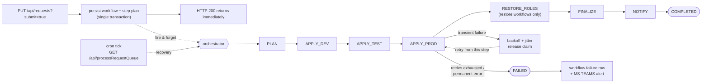
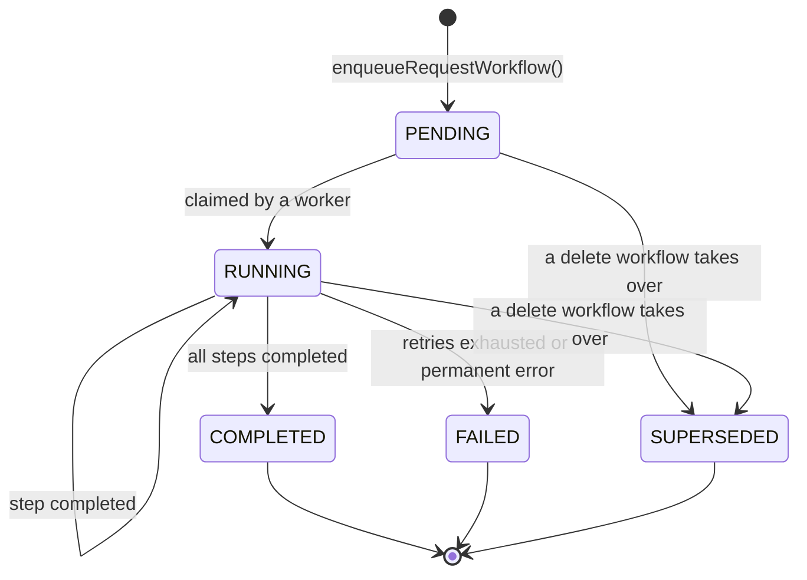
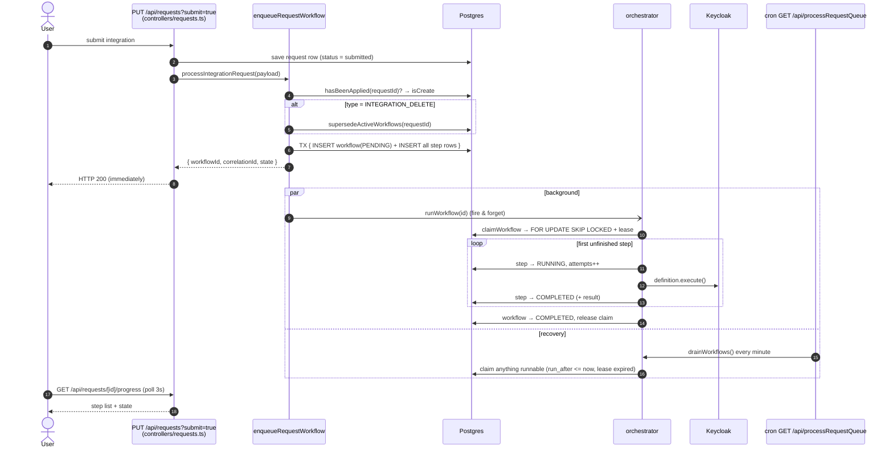
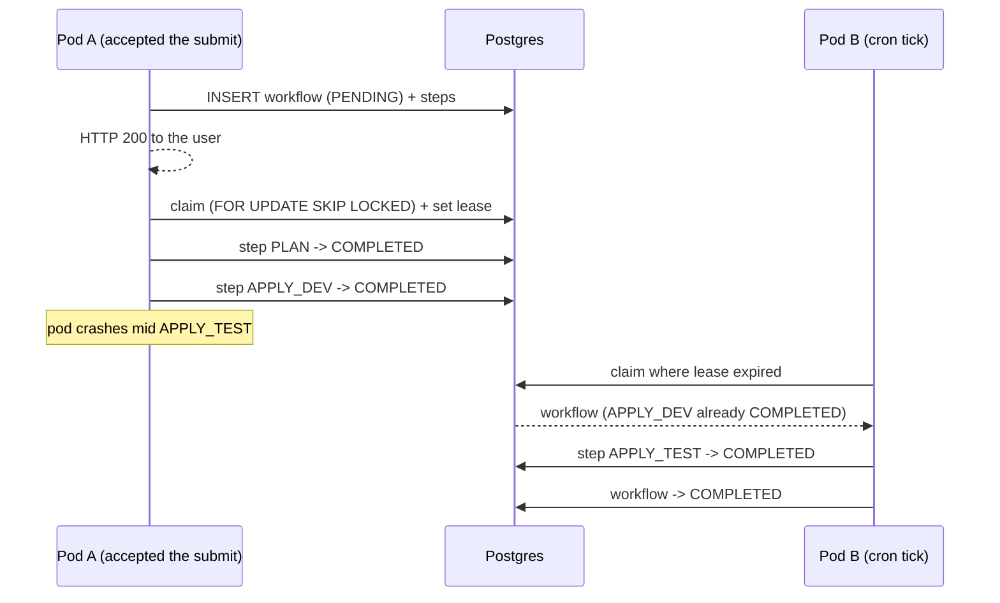
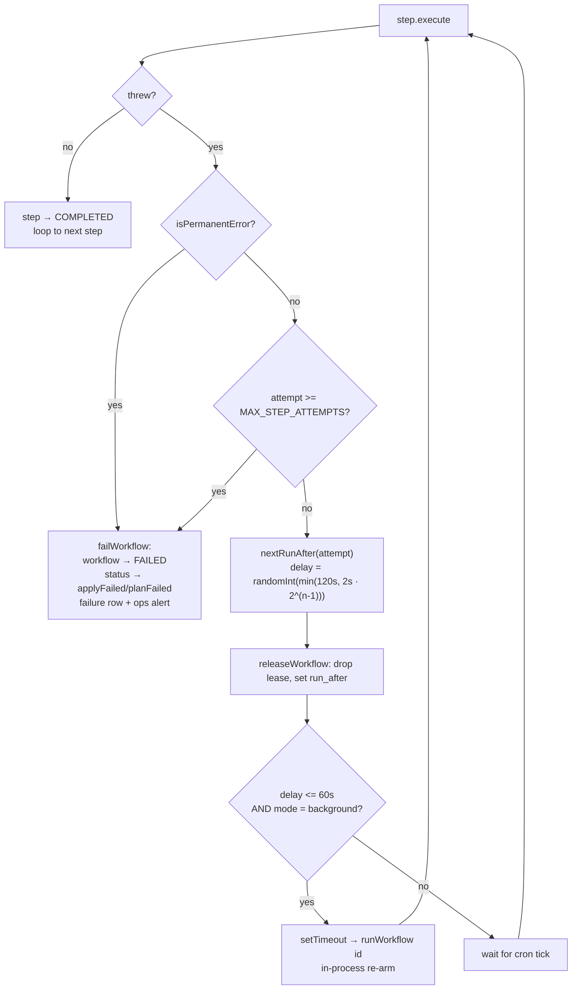

# ADR 0001: Asynchronous integration submission via a Postgres-backed workflow (SAGA Pattern)

- **Status:** Accepted
- **Date:** 2026-09-15
- **Supersedes:** the synchronous integration request processing

## Context

When a user submitted an integration request, `updateRequest` called `processIntegrationRequest` →
`standardClients` **inside the HTTP request/response cycle**. That function then awaited `keycloakClient(env, ...)` for every environment, then updated
the request status and sent email — all before the browser got a response.

Problems with that design:

1. **The user waited.** A submission touching three environments performs dozens of Keycloak admin
   calls (client create/update, IdP, client scopes, protocol mappers, roles, plus BCSC and Entra
   provisioning). Slow or degraded Keycloak meant a spinning browser tab and, eventually, a gateway
   timeout even though the work was still running server-side. This worsened when user opted for BC
   Services Card or BCGOV IDIR, which initiated more calls to setup a client at the IDP.
2. **Failure state was coarse.** All environments were applied with `Promise.all`; a single failure
   collapsed to `status = 'applyFailed'` with no record of _which_ environment or _which_ operation
   failed.
3. **Recovery was blunt.** `retryFailedRequests` (cron, every 5 min) re-ran **every** environment
   for a queued item, re-doing work that had already succeeded, with a flat retry counter and no
   backoff.
4. **No user-visible progress.** The dashboard showed an indefinite spinner until the row flipped to
   `applied`.

## Decision

Submission is handed to a **workflow orchestrator** whose state lives in Postgres. The HTTP handler
persists the workflow and returns immediately; execution happens in the background and the user
watches it on the dashboard.

We deliberately chose a **forward-only workflow**: there are no compensating actions. When a step fails
it is retried _from that step_; work that already succeeded is left in place.

### Flow

### Workflow lifecycle

### End to End flow

### Claiming and recovery across pods

### Retries

## Design rules

### 1. Idempotency and de-duplication

- Each workflow carries a `requestWorkflowId` (UUID primary key) and a `correlationId`.
- **Step rows are the idempotency ledger.** `request_workflow_steps` has a unique
  `(request_workflow_id, name)` constraint; a step already in `COMPLETED` is skipped on replay, so re-delivering
  the same command is a safe no-op.
- A **partial unique index** allows only one active workflow per integration:
  `CREATE UNIQUE INDEX ... ON request_workflows (request_id) WHERE state IN ('PENDING','RUNNING',...)`.
  A double-click or a retried HTTP request gets the existing workflow back instead of a second workflow.
- Audit events are written through `emitWorkflowEventOnce`, which stamps `details.requestWorkflowId` and checks for
  an existing row first, so a crash between the event insert and the step commit cannot duplicate
  the change history.
- `keycloakClient` was already a converge-to-desired-state operation (find-or-create for the client,
  roles, scopes and mappers), which is what makes re-running a partially applied step safe.

### 2. Explicit state persistence

- Nothing executes until the workflow **and its full step plan** are committed in one transaction.
- The step plan is rebuilt deterministically from the persisted `payload` + `context`
  (`buildRequestWorkflowSteps`), so a pod can resume a workflow another pod started.
- Every transition (`PENDING → RUNNING`, step `RUNNING → COMPLETED`, retry scheduling, terminal
  state) is written **before** the corresponding side effect is attempted.

### 3. Forward-only failure handling (no rollback)

Compensating actions were evaluated and rejected. Rolling back an integration update means deleting
or reverting Keycloak clients that may already be serving live logins; the blast radius of a bad
rollback is worse than the partial state it repairs. Instead:

- A failed step is retried from exactly that step. Completed steps are never re-run or undone.
- After `MAX_STEP_ATTEMPTS` (or a `PermanentStepError`) the workflow moves to the terminal `FAILED`
  state — it is never parked in an intermediate state — and the request becomes `applyFailed`
  (`planFailed` if the `PLAN` step failed).
- Operators re-drive a failed workflow by resubmitting, which is de-duplicated and resumes from the
  failed step.

### 4. Resiliency and fault tolerance

- **Exponential backoff with full jitter** (`backoffDelayMs`), persisted as the workflow's `run_after`.
  Jitter prevents every pod that failed against the same Keycloak outage from retrying in lockstep.
- **`SELECT ... FOR UPDATE SKIP LOCKED`** claims plus a **lease** (`claimed_by` / `claimed_at`)
  guarantee a single owner per workflow and make a workflow abandoned by a crashed pod claimable again once
  the lease expires. A heartbeat refreshes the lease during long steps so it is not stolen mid-flight.
- Retries shorter than `IN_PROCESS_RETRY_CEILING_MS` are re-armed with an in-process timer; anything
  longer (and anything lost to a restart) is picked up by the cron tick.
- Exhausted or permanently failed workflows are written to `request_workflow_failures` and raise a
  Rocket.Chat ops alert.

### 5. Code quality and observability

- No nested try/catch: the orchestrator is an explicit loop over a persisted step plan
  (`runNextStep` / `execute`), with step bodies declared as data in `steps/integration.ts`.
- Structured JSON logging (`app/workflow/logger.ts`) with the `correlationId` propagated across every
  async boundary, plus duration metrics per step and per workflow.
- The `correlationId` is surfaced to the user on failure so support can join the UI report to the
  server logs.

## Consequences

### Data model

Three new tables (`db/src/migrations/2026.09.15T10.00.00.create-request-workflow-tables.ts`):

| Table                           | Purpose                                                                                            |
| ------------------------------- | -------------------------------------------------------------------------------------------------- |
| `request_workflows`             | One row per workflow: state, payload snapshot, context, claim/lease, `run_after`, `correlation_id` |
| `request_workflow_steps`        | The persisted plan and the idempotency ledger; unique on `(request_workflow_id, name)`             |
| `request_workflow_dead_letters` | Unrecoverable workflows awaiting manual intervention                                               |

Other migrations:

- `2026.09.15T10.05.00.add-request-workflow-statuses` — adds `processing` to the `requests.status` enum.
  It also adds a `compensating` label; rollback was removed after this migration shipped, so that
  label (and the `compensation_attempts` column) is inert and no code writes it.
- `2026.09.15T10.10.00.drop-request-queues-table` — drops `request_queues`. The `RequestQueue`
  sequelize models were deleted from both `app/` and `api/`.

### Request status transitions

`submitted → planned → processing → applied`, or `→ planFailed` / `→ applyFailed` on terminal
failure. `getStatusDisplayName` maps the new `processing` value to the existing "Submitted" display
name, so nothing downstream had to change; `hasAnyPendingStatus` includes it so the dashboard keeps
polling.

### Code layout

| Path                                | Responsibility                                                                               |
| ----------------------------------- | -------------------------------------------------------------------------------------------- |
| `app/workflow/types.ts`             | `WorkflowState`, `StepState`, `WorkflowContext`, `PermanentStepError` / `TransientStepError` |
| `app/workflow/backoff.ts`           | Retry limits, lease window, exponential backoff with jitter                                  |
| `app/workflow/logger.ts`            | Structured logging with correlation-id propagation                                           |
| `app/workflow/store.ts`             | Persistence, `SKIP LOCKED` claiming, leases, dead letters                                    |
| `app/workflow/steps/integration.ts` | The step definitions (`PLAN`, `APPLY_<ENV>`, `RESTORE_ROLES`, `FINALIZE`, `NOTIFY`)          |
| `app/workflow/orchestrator.ts`      | The state machine: `runWorkflow(id)`, `drainWorkflows()`                                     |
| `app/workflow/request-worklfow.ts`  | `enqueueRequestWorkflow()`, `getIntegrationProgress()`                                       |
| `app/workflow/effects.ts`           | Side effects moved out of the controller: notifications, role restoration                    |

`updatePlannedIntegration` moved from `app/controllers/requests.ts` to `app/workflow/effects.ts`, and
`createEvent` moved to `app/queries/event.ts`. Controllers import `createEvent` from
`app/queries/event` **directly** — re-exporting it from `controllers/requests.ts` breaks the test
suites that spread `jest.requireActual('@app/controllers/requests')`, because the re-export getter
is evaluated while the module graph is mid-cycle.

### Flows that changed

| Flow                                                  | Behaviour                                                                                                                         |
| ----------------------------------------------------- | --------------------------------------------------------------------------------------------------------------------------------- |
| Submit / update integration                           | Asynchronous                                                                                                                      |
| Delete integration                                    | Asynchronous; supersedes any in-flight workflow for that integration                                                              |
| Restore integration                                   | Asynchronous; role re-creation and the restore email became workflow steps so they only run once the Keycloak clients exist again |
| Resubmit                                              | Now means "retry the workflow"; accepts in-flight and failed statuses and re-drives the existing workflow                         |
| Team API service accounts (`app/controllers/team.ts`) | Still synchronous via `{ awaitCompletion: true }`, because the caller reads the client credentials immediately afterwards         |

### User interface

- New endpoint `GET /api/requests/[id]/progress`, authorized with the same rules as the integration
  itself, returning the workflow projection (`app/interfaces/WorkflowProgress.ts`).
- `app/components/SubmittedStatusIndicator.tsx` renders the live step list — progress bar, per-step
  spinner/check/cross, and on failure the failed step plus contact-the-SSO-team guidance quoting the
  correlation id. There is no retry button by design.
- `IntegrationInfoTabs` polls every 3 seconds. **While the workflow is active the progress tab is the
  only tab** (nothing is configured yet, so Technical Details would be misleading). Once the workflow
  completes the tab disappears; if it failed, the tab stays alongside the other tabs.

### Operations

- `GET /api/processRequestQueue` now calls `drainWorkflows()` — the recovery tick that re-claims workflows
  waiting on backoff, never started, or abandoned by a crashed pod. The cron schedule moved from
  every 5 minutes to every minute.
- Tuning knobs (all optional):

  | Variable                               | Default      | Meaning                                               |
  | -------------------------------------- | ------------ | ----------------------------------------------------- |
  | `WORKFLOW_MAX_STEP_ATTEMPTS`           | `5`          | Attempts per step before decalring it failed          |
  | `WORKFLOW_CLAIM_LEASE_SECONDS`         | `300`        | Lease window before a claim is considered abandoned   |
  | `WORKFLOW_RETRY_BASE_DELAY_MS`         | `2000`       | Backoff base                                          |
  | `WORKFLOW_RETRY_MAX_DELAY_MS`          | `120000`     | Backoff ceiling                                       |
  | `WORKFLOW_IN_PROCESS_RETRY_CEILING_MS` | `60000`      | Above this, retries wait for the cron tick            |
  | `WORKFLOW_EXECUTION_MODE`              | `background` | `background` \| `synchronous` \| `manual` (see below) |

### Testing

`WORKFLOW_EXECUTION_MODE` makes execution explicit rather than inferred from `NODE_ENV` (which the API
suite sets to `development`):

- `background` — production. Kick off in-process, cron recovers.
- `synchronous` — run to completion before returning. Set in `app/jest-api/jest.setup.js` so the
  pre-existing API specs still observe the final outcome within the request call.
- `manual` — persist only; the caller drives execution. Used by
  `app/jest-api/17.request-workflow.test.ts`, which covers the happy path, de-duplication,
  idempotent replay, resumption from a failed step, backoff retries, and marking it failed.

`app/jest/submissionProgressTab.test.tsx` covers the tab behaviour.

## Alternatives considered

| Option                                                        | Why not                                                                                                                                                                                                         |
| ------------------------------------------------------------- | --------------------------------------------------------------------------------------------------------------------------------------------------------------------------------------------------------------- |
| Keep `request_queues`, just move execution to the cron        | Progress would be delayed by the tick interval, retries would still re-run every environment, and there would still be no per-step visibility.                                                                  |
| Compensating transactions (classic workflow rollback)         | Deleting or reverting Keycloak clients that may be serving live logins is more dangerous than the partial state it repairs. Rejected in favour of forward-only retry.                                           |
| A dedicated worker service or external queue (Redis/RabbitMQ) | New infrastructure and deployment surface for a workload that Postgres row-level locking handles comfortably at this volume.                                                                                    |
| Decomposing `keycloakClient` into per-resource steps          | Much richer progress, but a significant rewrite of `app/keycloak/integration.ts` with real regression risk. Per-environment granularity was enough for the UI. Revisit if per-resource recovery is ever needed. |
